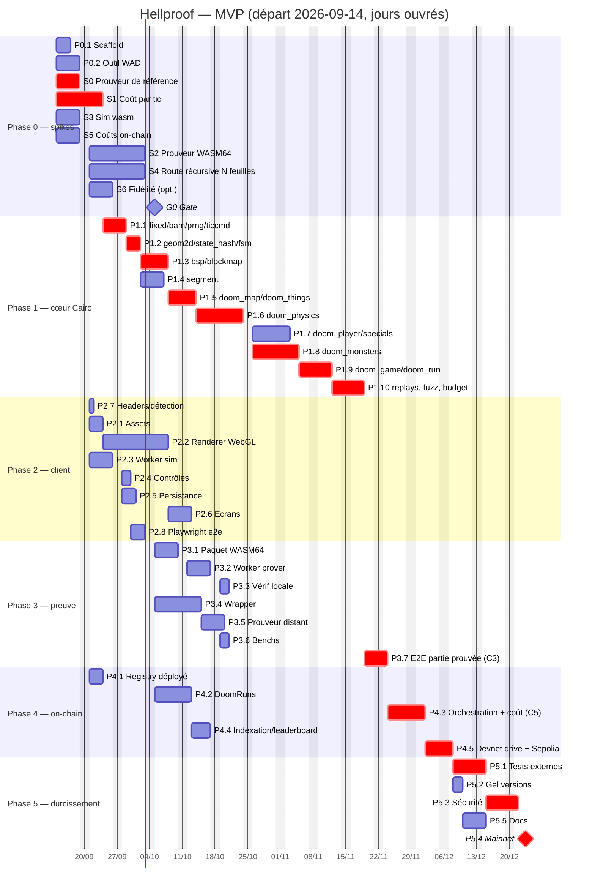

# ROADMAP — Hellproof

> WBS complet des étapes du [PLAN.md](PLAN.md), dépendances, Gantt, chemin critique et lignes
> parallèles. Départ : lundi **2026-09-14**. Durées en jours ouvrés (jo). Version du 2026-09-12.

## 1. WBS et dépendances

Lanes : **PRV** prouveur/Rust, **CAI** Cairo cœur, **WEB** client, **TOOL** outils, **CHN** contrats/on-chain, **INF** infra.

| Id | Tâche | Lane | Durée | Dépend de | Livrable / critère |
|----|-------|------|------:|-----------|--------------------|
| **Phase 0 — spikes (sem. 1–3)** |||||
| P0.1 | Scaffold : workspace Scarb, `LICENSES/`, `REUSE.toml`, `NOTICE`, CI, template de spike | INF | 3 | — | CI verte sur workspace vide |
| P0.2 | Outil WAD (`tools/wad`) : `freedoom1.wad` E1M1 → JSON client + constantes Cairo, stats de map | TOOL | 5 | — | Rapport des spéciaux/things présents |
| S0 | Pipeline de preuve de référence (monorepo épinglé, `canonical_small`, bootloader, profil mémoire, paniques) | PRV | 5 | — | `docs/spikes/S0.md`, RSS(2^20) |
| S1 | Coût par tic : prototype Cairo (map, joueur, 5 monstres, REJECT) | CAI | 8 | — | steps/tic mesuré, top-10 fonctions |
| S2 | Prouveur WASM64 : build reproductible, mesure Chrome 2^18–2^21 | PRV | 10 | S0 (params) | temps/RSS navigateur |
| S3 | Sim temps réel : wrapper wasm cairo-vm avec programme en cache, ≥ 100 tics/s | WEB | 5 | — | benchmark tics/s |
| S4 | Route récursive N feuilles : registre `doom` (log 20), `leaf_prover`, `recursive_tree`, recomposition `packed_output` en Cairo | CHN | 10 | S0 (format feuille) | racine acceptée N ∈ {1,2,4,8,50} |
| S5 | Coûts réels : registry sur devnet/Sepolia avec fixture, `simulateTransactions` vs reçus | CHN | 5 | — | écart < 20 % |
| S6 | (opt.) Harnais de fidélité doomgeneric | TOOL | 5 | P0.2 | écarts documentés |
| G0 | Gate : verdicts, K, budget steps, licence, hébergement | — | 1 | S0–S5 | décisions consignées |
| **Phase 1 — cœur Cairo (sem. 4–11)** |||||
| P1.1 | Crates niveau 0 : `fixed`, `bam`, `prng`, `ticcmd` (parallèles) | CAI | 3 | G0 | tests réf. C, couverture ≥ 90 % |
| P1.2 | `geom2d`, `state_hash`, `fsm` (parallèles) | CAI | 3 | P1.1 | idem |
| P1.3 | `bsp`, `blockmap` (parallèles) | CAI | 4 | P1.2 | idem |
| P1.4 | `segment` | CAI | 3 | P1.2 | associativité testée |
| P1.5 | `doom_map` (génération), `doom_things` (parallèles) | CAI | 4 | P1.3, P0.2 | données typées |
| P1.6 | `doom_physics` (TryMove, SlideMove, PathTraverse, CheckSight) | CAI | 8 | P1.5 | budget TryMove ≤ 1 000 |
| P1.7 | `doom_player`, `doom_specials` (parallèles) | CAI | 6 | P1.6 | partie scriptée jusqu'à la sortie |
| P1.8 | `doom_monsters` | CAI | 8 | P1.6 | IA cadencée, budget tenu |
| P1.9 | `doom_game` + `doom_run` (`genesis`, `step_tic`, `run_segment`) | CAI | 5 | P1.4, P1.7, P1.8 | C2 natif |
| P1.10 | Replays dorés, fuzz de prouvabilité, test de budget CI, optimisation | CAI | 5 | P1.9 | C7 |
| **Phase 2 — client (sem. 4–10)** |||||
| P2.1 | Chargement assets Freedoom + JSON niveau | WEB | 3 | P0.2 | textures/sprites affichés |
| P2.2 | Renderer WebGL (secteurs, murs, sprites, HUD, interpolation) | WEB | 10 | P2.1 | 60 fps sur la map |
| P2.3 | Worker sim (cairo-vm wasm) + bus d'état partagé | WEB | 5 | S3, P1.9 (prog. réel ; prototype S1 avant) | 35 Hz stables |
| P2.4 | Contrôles → ticcmd | WEB | 2 | P2.3 | parité Doom |
| P2.5 | Persistance IndexedDB, export/import | WEB | 3 | P2.3 | C6 |
| P2.6 | Écrans (titre, fin, file de preuve) | WEB | 3 | P2.2 | — |
| P2.7 | En-têtes COOP/COEP, détection Memory64/RAM | WEB | 1 | — | bascule testée |
| P2.8 | Playwright e2e (partie scriptée → hash) | WEB | 3 | P2.4 | C2 navigateur |
| **Phase 3 — pipeline de preuve (sem. 6–12)** |||||
| P3.1 | Paquet WASM64 épinglé (`execute`/`prove`/`verify`) | PRV | 5 | S2 | hash d'artefact reproductible |
| P3.2 | Worker prover : segments pendant la partie, file, reprise | PRV | 5 | P3.1, P2.5 | R6-A1 |
| P3.3 | Vérification locale + chaînage | PRV | 2 | P3.2 | — |
| P3.4 | Service wrapper (feuilles, arbre, API proof-only, quotas) | PRV | 8 | S4 | wrap N=48 < 10 min |
| P3.5 | Prouveur distant (repli) | PRV | 3 | P3.4 | délai annoncé |
| P3.6 | Benchs continus | PRV | 2 | P3.2 | artefacts CI |
| P3.7 | **E2E : partie complète prouvée** | PRV | 3 | P1.10, P3.3, P3.4 | **C3** |
| **Phase 4 — on-chain (sem. 12–16)** |||||
| P4.1 | Déploiement registry Stwo (devnet, Sepolia) | CHN | 3 | S4, S5 | `is_valid` sur notre racine |
| P4.2 | `DoomRuns` (fait, chaînage, unicité, versions, leaderboard) | CHN | 6 | S4 | snforge + devnet drive |
| P4.3 | Orchestration client 4 tx + écran de coût | WEB | 6 | P4.2, S5, P3.7 | **C5** |
| P4.4 | Indexation (Torii/événements) + page leaderboard | WEB | 4 | P4.2 | — |
| P4.5 | Devnet drive + e2e Sepolia (10 parties) | CHN | 4 | P4.3 | **C4** |
| **Phase 5 — durcissement (sem. 16–19)** |||||
| P5.1 | Tests externes, télémétrie, compatibilité | INF | 5 | P4.5 | rapport |
| P5.2 | Gel des versions, hashes publiés | INF | 2 | P4.5 | — |
| P5.3 | Revue sécurité, audit léger, `freeze_routes` | CHN | 5 | P5.2 | — |
| P5.4 | Mainnet | CHN | 3 | P5.3 | — |
| P5.5 | Documentation, runbook | INF | 3 | P5.2 | — |

## 2. Gantt



## 3. Chemin critique

```
S1 (8) → P1.1 (3) → P1.2 (3) → P1.3 (4) → P1.5 (4) → P1.6 (8) → P1.8 (8) → P1.9 (5) → P1.10 (5)
   → P3.7 (3) → P4.3 (6) → P4.5 (4) → P5.1 (5) → P5.3 (5) → P5.4 (3)  ≈ 74 jo ≈ 15 semaines
```

Le chemin critique passe par le **cœur Cairo**, pas par le prouveur : la chaîne prouveur
(S0 5 → S2 10 → P3.1 5 → P3.2 5 → P3.7) ne fait que 28 jo avant de rejoindre P3.7. Conséquences :

1. **Staffer le cœur Cairo en premier** et y mettre la parallélisation maximale (P1.1–P1.5 sont
   des groupes de crates indépendantes : jusqu'à 4 agents en parallèle).
2. Les chaînes prouveur et on-chain ont **~6 semaines de marge** : elles absorbent les aléas de S2/S4.
3. Le renderer (P2.2, 10 jo) est hors chemin critique mais long : à démarrer dès que P0.2 livre le JSON.
4. Gains possibles sur le chemin critique : paralléliser `doom_monsters` et `doom_player` (déjà fait),
   commencer `doom_physics` sur les données du prototype S1 sans attendre P1.5 (gain ~4 jo),
   réduire le périmètre monstres (R2-A6).

## 4. Parallélisation : ce qui peut tourner en même temps

| Créneau | Lignes parallèles (worktrees distincts) |
|---|---|
| Semaine 1 | P0.1 · P0.2 · S0 · S1 · S3 · S5 (6 lignes) ; S2 et S4 démarrent leurs builds sans attendre S0 |
| Semaines 2–3 | S1 · S2 · S4 · S6 · P2.7 · P2.1 ; G0 le 2026-10-02 |
| Semaines 4–5 | P1.1/P1.2 (4 crates en parallèle) · P2.2 · P2.3 · P3.1 · P3.4 |
| Semaines 6–8 | P1.3/P1.4/P1.5 · P2.4–P2.6 · P3.2/P3.3/P3.6 · P4.2 |
| Semaines 9–11 | P1.6 → P1.7 ‖ P1.8 · P2.8 · P3.5 · P4.1 · P4.4 |
| Semaines 12–16 | P1.9/P1.10 → P3.7 → P4.3 → P4.5 (séquentiel, critique) ‖ docs |
| Semaines 16–19 | P5.1 ‖ P5.2/P5.5 → P5.3 → P5.4 |

Règles de parallélisation entre agents :

- **Un répertoire par ligne** : `spikes/s<n>/` pour les prototypes jetables, `docs/spikes/S<n>.md`
  pour les notes ; `cairo/`, `tools/wad/`, `client/`, `prover/`, `infra/` pour les livrables.
  Aucune ligne ne modifie les fichiers d'une autre ; les fichiers racine (`README.md`, `PLAN.md`…)
  ne sont modifiés que par l'orchestrateur.
- **Ressources machine** : au plus **une preuve > 2^19 steps à la fois** sur une machine 64 GB
  (S0/S2/S4 se coordonnent par un fichier de verrou `.proof-lock` dans le scratchpad) ; builds Rust
  avec `CARGO_TARGET_DIR` propre à chaque ligne.
- **Intégration** : chaque ligne commite sur sa branche de worktree avec des commits atomiques ;
  l'orchestrateur relit, fait tourner la CI et merge sur `main` (fast-forward ou merge commit).

## 5. Orchestration par sous-agents (semaine 1)

| Ligne | Agent | Modèle | Worktree / répertoire | Sortie attendue |
|---|---|---|---|---|
| P0.1 + R9 | `infra-scaffold` | Sonnet | `cairo/`, `LICENSES/`, `.github/`, `docs/spikes/TEMPLATE.md` | CI verte, licences REUSE |
| P0.2 | `tools-wad` | Sonnet | `tools/wad/` | JSON + constantes Cairo E1M1, rapport de map |
| S0 | `s0-prover` | Opus | `spikes/s0/`, `docs/spikes/S0.md` | pipeline monorepo, profil mémoire, verdict paniques |
| S1 | `s1-steps` | Opus | `spikes/s1/`, `docs/spikes/S1.md` | steps/tic, profil |
| S2 | `s2-wasm64` | Fable | `prover/wasm/`, `docs/spikes/S2.md` | build reproductible, mesures Chrome |
| S3 | `s3-sim` | Opus | `prover/sim/`, `docs/spikes/S3.md` | tics/s |
| S4 | `s4-recursion` | Fable | `spikes/s4/`, `cairo/crates/recursion_outputs/` (plus tard), `docs/spikes/S4.md` | registre `doom`, racine N feuilles, recomposition |
| S5 | `s5-costs` | Opus | `spikes/s5/`, `docs/spikes/S5.md` | coûts devnet/Sepolia, script d'estimation |

L'orchestrateur (session principale) : lance les lignes, surveille les rapports, résout les conflits,
merge sur `main`, met à jour `CONTEXT.md`/`RISKS.md` avec les résultats, prononce G0.
